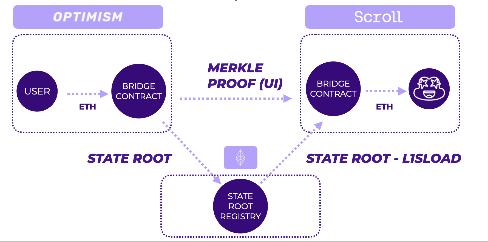

# Trustless Bridge

**Trustless Bridge** from Optimism to Scroll leveraging L1SLOAD precompile

## Demo video

https://youtu.be/07ohcE1I7_Y

## Workflow

1.	The user wants to transfer ETH from OP to Scroll. They initiate an ETH transfer from their address to the bridge contract, and a corresponding deposit note appears in the bridge contract’s storage.
2.	The UI waits for the OP network to update its state root on L1.
3.	The user initiates a transaction on the Scroll network:
	-	The UI transmits the Merkle proof of the OP deposit and bridge parameters (asset, value, recipient) to the bridge contract on Scroll.
	-	A smart contract on Scroll requests the OP state root from L1 using the L1SLOAD precompile, then verifies the validity of the Merkle proof for the received root and bridge parameters.
	-	Once the check is successful, the assets are transferred to the recipient’s wallet on the Scroll network.
